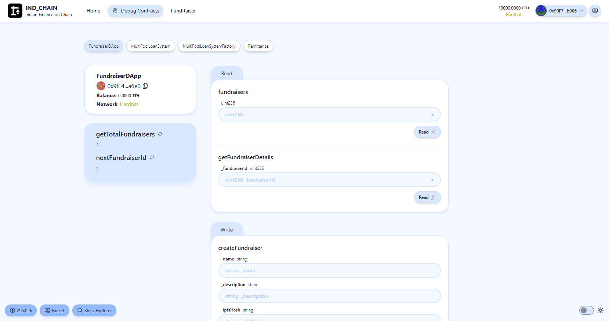
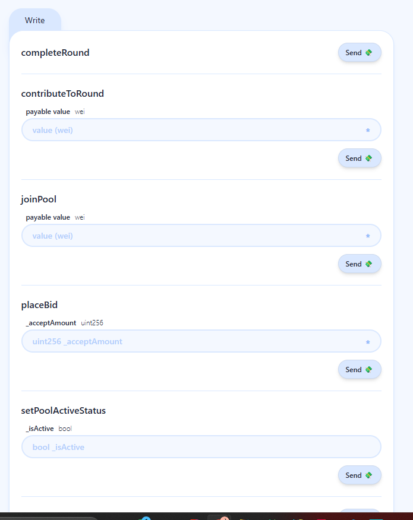
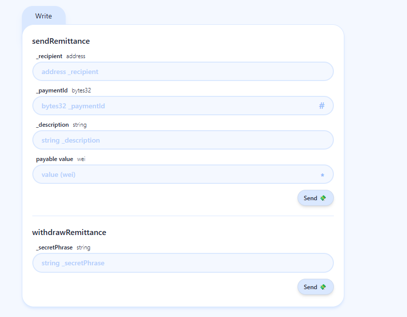
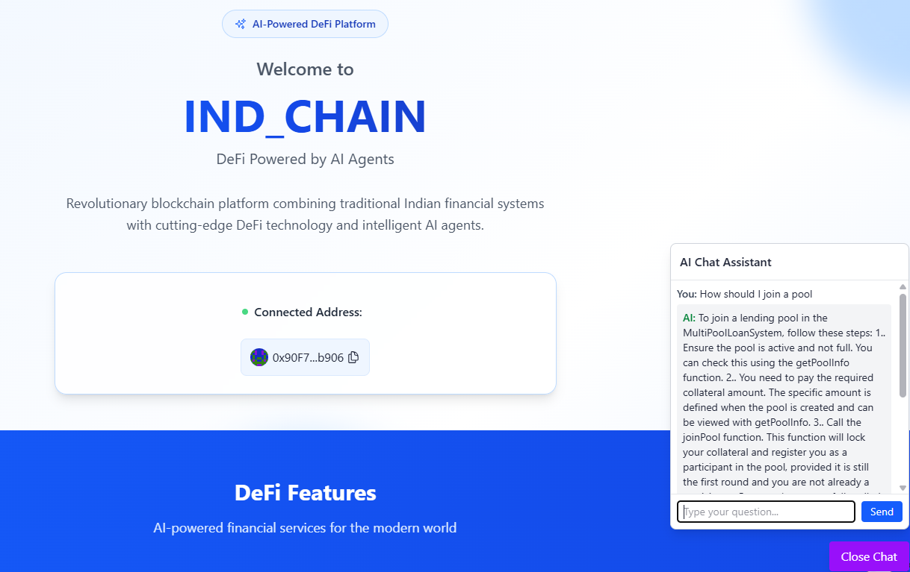
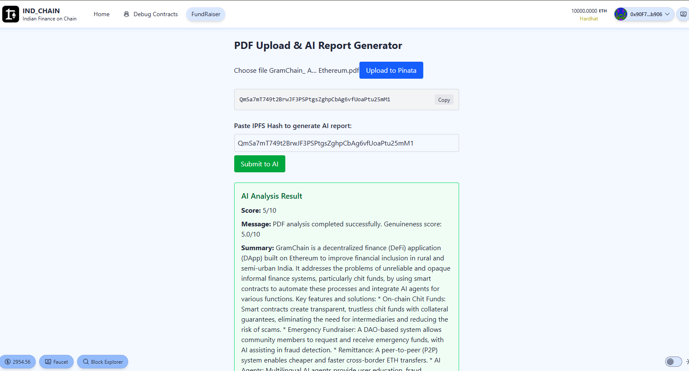

# IND_CHAIN
**Team Name:** JANA NAYAGAN

Welcome to our submission for the Agentic Ethereum Hackathon by Reskilll & Geodework! This repository includes our project code, documentation, and related assets.

## 📌 Problem Statement
- Millions in India rely on informal finance — prone to scams, fees, and lack of transparency.
- Chit funds are often run by private companies that charge organizing fees and may disappear with user money.
- Rural remittances still depend on intermediaries or cash carriers.
- Emergency fundraising options are limited or inefficient.
- Financial literacy and credit scoring are limited or non-existent for these populations.

## 💡 Our Solution
**Project Name:** IND_CHAIN  
GramChain (now IND_CHAIN) brings the power of Ethereum-based DeFi and AI agents to automate and democratize grassroots financial services:
1. **On-chain Chit Funds:** Smart contracts ensure trustless, rule-based chit funds with collateral guarantees.
2. **Emergency Fundraiser:** DAO-based mechanism for raising and verifying genuine need.
3. **Remittance:** P2P transfer system with accountability.
4. **AI Agents:** Assist users, detect fraud, explain features in local languages.

Together, these systems reduce dependency on central actors and enable autonomous, scalable community finance.

## Why Blockchain Matters for Chit Funds
Traditionally, chit funds are profitable for private organizers — they:
- Take cuts from each round.
- Rely on user trust without guarantees.
- Have led to scams or mismanagement.

With IND_CHAIN:
- Smart contracts automate the entire process — no organizer needed.
- All actions are on-chain, transparent, and immutable.
- No fees for participation.
- Collateral ensures commitment.
- DAO and AI agents handle verification and fairness.

Thus, trust is shifted from human intermediaries to code — a secure, trustless system built for communities.

# IND_CHAIN

IND_CHAIN is a cutting-edge Web3 and AI-powered platform designed to revolutionize financial collaboration and fundraising. The project integrates blockchain technology with AI to provide secure, transparent, and intelligent solutions for chit funds, group formation, fundraisers, and remittance.

## Features

### Web3XAI Integration
- **Chit Funds**: Create and manage chit fund groups securely using blockchain technology. Visualize a group of individuals pooling their resources together, with smart contracts ensuring fairness and transparency. For example, imagine a family saving for a wedding, where each member contributes monthly, and the funds are distributed automatically based on predefined rules.
- **Group Formation**: Form groups for collaborative financial activities with ease. Picture a community of farmers coming together to pool resources for purchasing equipment, with blockchain ensuring every transaction is recorded immutably.
- **Fundraisers**: Launch fundraising campaigns with transparency and accountability. Envision a charity raising funds for disaster relief, where donors can track how their contributions are utilized through real-time updates on the blockchain.
- **Remittance**: Send and receive funds securely and efficiently. Imagine a migrant worker sending money back home, with reduced fees and instant transactions powered by blockchain.

### AI-Powered Enhancements
- **Document Verification and Summarization**: AI agents verify and summarize documents for fundraisers, ensuring authenticity and clarity. For instance, a fundraiser for a medical emergency uploads a doctor's report, and the AI agent verifies its authenticity while summarizing the key details for potential donors.
- **AI Chatbot**: An intelligent chatbot is integrated to assist users with navigating the application and answering queries. Visualize a user asking the chatbot how to start a chit fund, and the bot provides step-by-step guidance, making the process seamless.

## Technologies Used
- **Blockchain**: Solidity smart contracts for secure and transparent operations.
- **AI**: Advanced AI models for document processing and user assistance.
- **Frontend**: React for a dynamic and user-friendly interface.
- **Backend**: Node.js for server-side operations.
- **Package Managers**: Yarn and npm for dependency management.

## Getting Started
1. Clone the repository.
2. Install dependencies using `yarn install` or `npm install`.
3. Start the development server with `yarn start` or `npm start`.

## License
This project is licensed under the MIT License.

## Visualizing Use Cases

### Chit Funds in Action
Imagine a group of ten friends who want to save money for a vacation. They decide to start a chit fund using IND_CHAIN. Each member contributes a fixed amount monthly, and the smart contract ensures that the pooled funds are distributed to one member each month based on a transparent lottery system. The blockchain records every transaction, ensuring trust and eliminating disputes.

### Fundraisers for Social Causes
Picture a non-profit organization launching a fundraiser to build a school in a rural area. They upload detailed plans and documents, verified by AI agents, to gain the trust of donors. Contributors can see the progress of the campaign in real-time, with updates on how the funds are being utilized.

### Efficient Remittance
Visualize a worker in a foreign country sending money back home to their family. With IND_CHAIN, the transaction is completed instantly, with minimal fees, and the family receives the funds securely. The blockchain ensures that the transaction is immutable and transparent.

### AI Chatbot Assistance
A user new to the platform wants to start a fundraiser but is unsure how to proceed. They interact with the AI chatbot, which provides step-by-step instructions, answers their questions, and even suggests best practices for creating a successful campaign.

IND_CHAIN combines the power of blockchain and AI to create a platform that is not only functional but also transformative, empowering individuals and communities to achieve their financial goals securely and transparently.

## Screenshots :
1. 
2. 
3. 
4. 
5. 
6. 

## Videos 
1. Fund raiser Flow

https://github.com/user-attachments/assets/ba3866ce-3a80-40d5-931a-d98ce558d462

2. Chit Fund Flow

https://github.com/user-attachments/assets/1ade2ada-541a-44ef-9b71-8cbfe6a32867

# Folder Structure :
1. Frontend -> packages/nextjs
2. Backend -> packages/hardhat
3. AI Agents -> AI Agents
